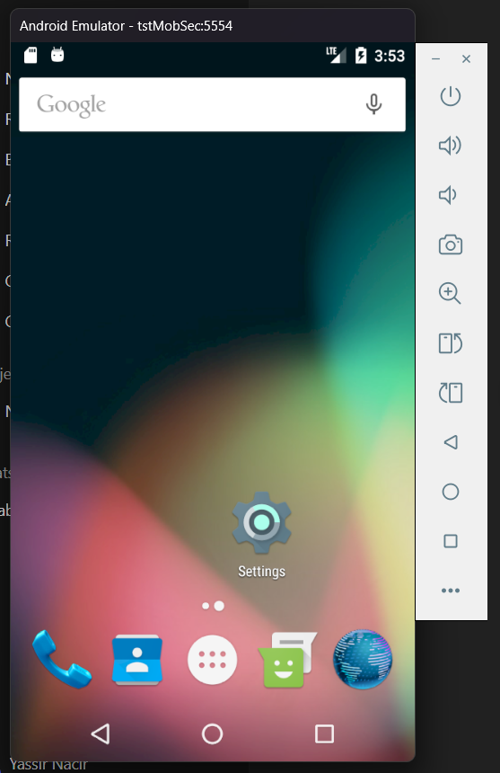
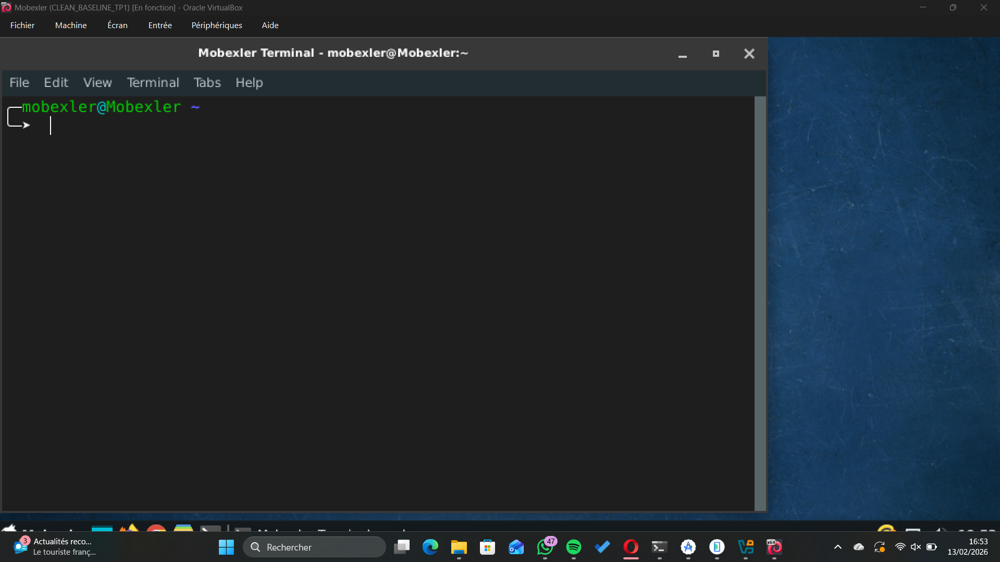
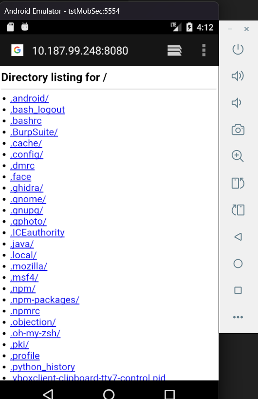
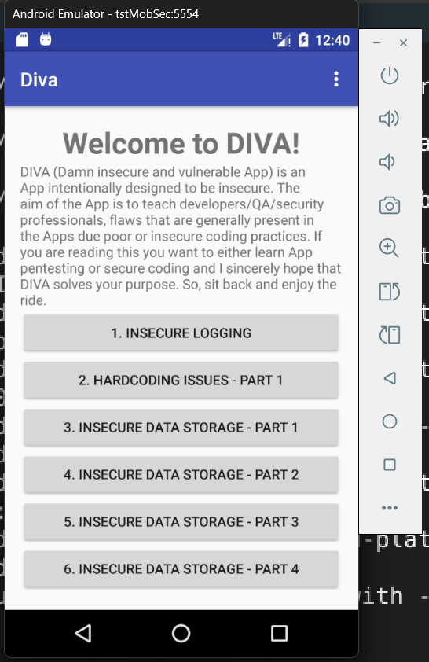
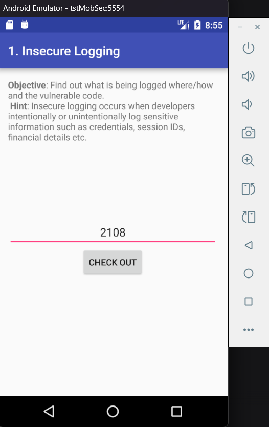
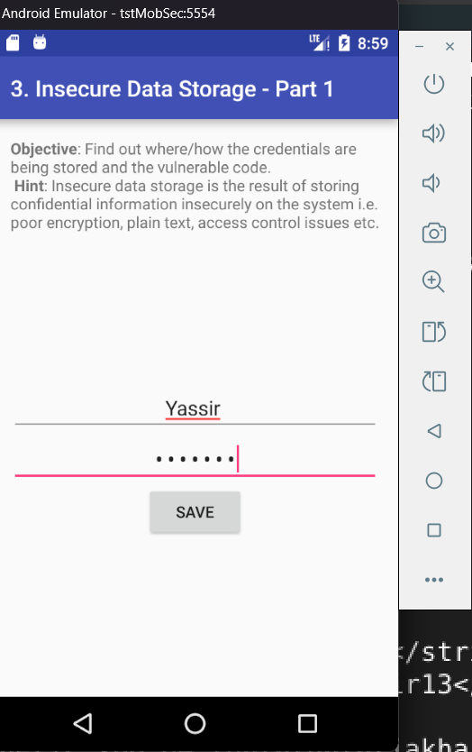
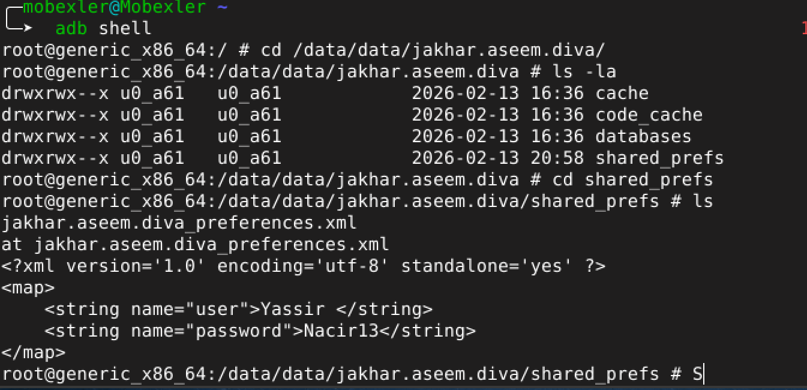
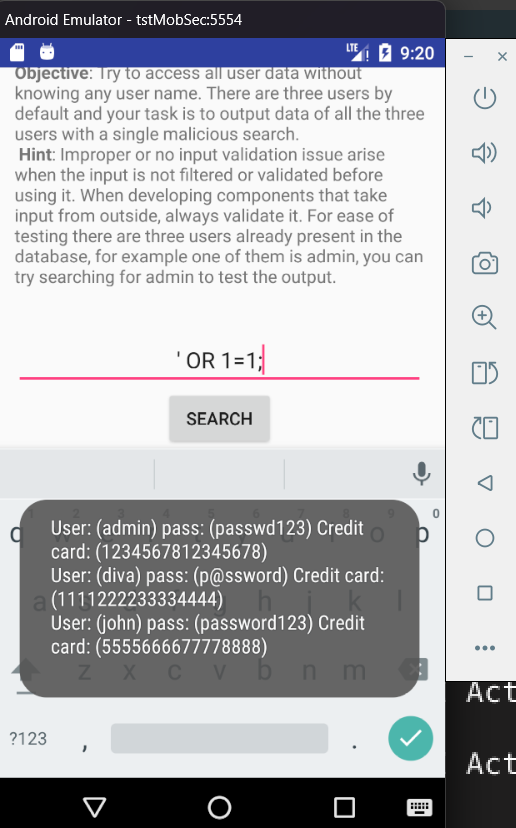

# LAB-Rooting-Android

Fiche périmètre 13/02/2026 :
    - App de test : Diva Application.
    - Support Utiliser : AVD custom (Google API 23) + Mobexler.
    - Objectif : Comprendre rooting et impacts au systeme.
    - Données : Fictives.
    - Réseau : réseau interne de ma machine hote(Windows).

# Sécurité Android :
La sécurité Android repose sur plusieurs couches et utilise plusieurs composant comme le sandboxing qui isole chaque application dans un espace ferme pour limiter l’impact d’un bug ou attaque eventuelle, et utilise aussi le modèle de permissions contrôle l’accès aux données et capteurs sensibles comme la caméra, GPS, stockage, etc, et l’intégrité du système (SELinux, Verified Boot, mises à jour) qui empêche et détecte les modifications non autorisées.

# Verified Boot : 
Verified Boot a pour objectif de garantir que le système qui démarre est authentique et n’a pas été modifié. Il vérifie l’intégrité du système dès le démarrage pour empêcher l’exécution d’un code malveillant. Concernant la "chain of trust", c'est une série de vérifications successives où chaque composant vérifie l’intégrité du suivant avant de lui transmettre le contrôle et c’est critique surtout dans le cas
ou démarrage est compromis et qui peu rendre toutes les protections de sécurité facile a être contournées.

# Android Verified Boot : 
AVB est la version moderne de Verified Boot qui est intégrée depuis le versions de Android 8.0 et qui vérifie l’intégrité des partitions système au démarrage grâce à des signatures cryptographiques et à dm-verity. AVB ajoute aussi une protection anti-rollback qui empêche l’installation d’anciennes versions vulnérables du système.

# Rooting : 
Le rooting est l'operation qui nous donne accès au privilege du super-utilisateur dans notre système Android de test. 
Cela modifie les protections et la confiance du système et utile car on peut accéder et modifier des fichiers protégés. 

# Scénarios appliquer sur Diva : 

Après le lancement de notre AVD et de notre machine virtuelle Mobexler, j’ai testé leur connectivité, qui se trouve sur un réseau interne de ma machine Windows.
En effectuant un test simple, j’ai lancé un serveur web depuis Mobexler et vérifié si l’AVD avait accès. Cette méthode a été utilisée car on ne peut pas tester avec ping,
car l’ADB de Mobexler va se connecter au téléphone via l’adresse IP de Windows et non pas de l’AVD.

Nous avons maintenant cloner l'application Diva depuis son repo git vers notre AVD pour qu'on puisse tester en dessous.

Pour le premier scenario (Insecure Logging) qui avait comme objectif de vérifier si l’application écrit des données sensibles dans les logs système.

Ensuite j'ai tester Insecure Data Storage pour voir si les identifiants entrer depuis Diva sont stockés en clair dans le système.

Puis finalement, SQL Injection pour tester l’absence de validation d’entrée et voir si l’exploitation SQL Injection depuis une application mobile est possible ou pas.

