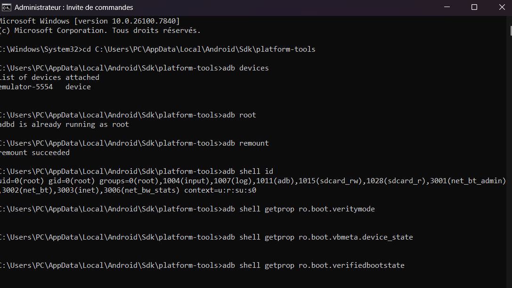
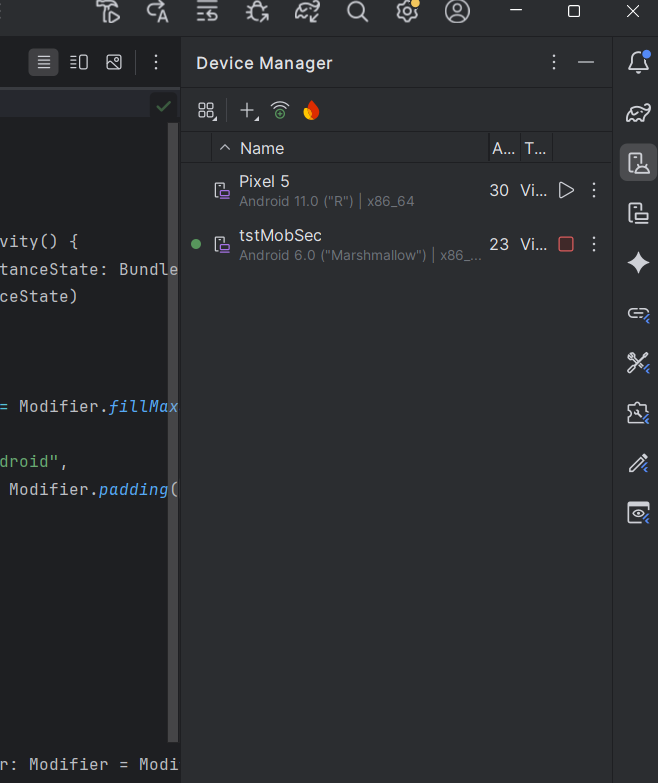

# LAB-Rooting-Android

Fiche périmètre 13/02/2026 :
    - App de test : Diva Application.
    - Support Utiliser : AVD custom (Google API 23) + Mobexler.
    - Objectif : Comprendre rooting et impacts au systeme.
    - Données : Fictives.
    - Réseau : réseau interne de ma machine hote(Windows).

# Sécurité Android :
La sécurité Android repose sur plusieurs couches et utilise plusieurs composant comme le sandboxing qui isole chaque application dans un espace ferme pour limiter l’impact d’un bug ou attaque eventuelle, et utilise aussi le modèle de permissions contrôle l’accès aux données et capteurs sensibles comme la caméra, GPS, stockage, etc, et l’intégrité du système (SELinux, Verified Boot, mises à jour) qui empêche et détecte les modifications non autorisées.

# Verified Boot : 
Verified Boot a pour objectif de garantir que le système qui démarre est authentique et n’a pas été modifié. Il vérifie l’intégrité du système dès le démarrage pour empêcher l’exécution d’un code malveillant. Concernant la "chain of trust", c'est une série de vérifications successives où chaque composant vérifie l’intégrité du suivant avant de lui transmettre le contrôle et c’est critique surtout dans le cas
ou démarrage est compromis et qui peu rendre toutes les protections de sécurité facile a être contournées.

# Android Verified Boot : 
AVB est la version moderne de Verified Boot qui est intégrée depuis le versions de Android 8.0 et qui vérifie l’intégrité des partitions système au démarrage grâce à des signatures cryptographiques et à dm-verity. AVB ajoute aussi une protection anti-rollback qui empêche l’installation d’anciennes versions vulnérables du système.

# Rooting : 
Le rooting est l'operation qui nous donne accès au privilege du super-utilisateur dans notre système Android de test. 
Cela modifie les protections et la confiance du système et utile car on peut accéder et modifier des fichiers protégés. 
Cette operation est effectuer via des commandes adb sur notre AVD.

# 8 RISQUE :

1. Une mauvaise configuration de notre labo peut menée a des résultats incohérentes a la situation actuelle ou au résultats attendus

2.Une surface d’attaque accrue hors du labo peut exposer l’appareil à des menaces externes imprévues.

3.Une mauvaise gestion des permissions peut par accident masquer certaines vulnérabilités dans notre environnement de test.

4.Une traçabilité insuffisante empêche de reproduire ou d’auditer correctement les tests effectués.

5.Un réseau non isolé peut causer des impacts involontaires sur des systèmes externes.

6.Un nettoyage insuffisant en fin de séance peut laisser persister des données sensibles sur l’appareil.

7.L'utilisation de notre appareil personnel pour effectuer de tests peut violer certaines conditions d'intégrité et meme laisser ou créer des vulnérabilités.

8.La présence de données sensibles peut entraîner une violation de confidentialité en cas d’accès non autorisé.

# 8 Mesures défensives :

1.Utilise un labo dédiée au test, nettoyer après chaque recherche.

2.Ne jamais utiliser nos appareil personnelles et utilise uniquement des donnees fictives pour éliminer tout risque.

3. Création d'un réseau interne et privée pour effectuer nos tests.

4.Ne pas tester sur n'importe quelle apk, uniquement sur les apk dédier a ce genre de tests ou ceux dont on a l'autorisation.

5.Journal de configuration détaillé pour assurer la reproductibilité.

6.L'utilisation des device ou AVD dédié exclusivement aux tests de sécurité.

7.Limiter l’usage du root aux étapes nécessaires.

8.Effectuer un reset complet ou supprimer l’AVD après chaque tests.

# MASVS :

1. MASVS-AUTH-1 :
L’application doit utiliser des protocoles d’authentification et d’autorisation sécurisés, en respectant les bonnes pratiques. Même si le contrôle principal est côté serveur, l’application mobile doit implémenter correctement ces mécanismes pour éviter les failles.

2. MASVS-CODE-1 :
L’application doit exiger une version récente et supportée du système d’exploitation afin de bénéficier des correctifs de sécurité et des protections modernes.

# MASTG :

1.MASTG-TEST-0311: Insecure Random API Usage : Certaines applications iOS utilisent des générateurs de nombres pseudo-aléatoires non sécurisés comme rand et  pas de générateurs cryptographiquement sûrs. Ce test vise à détecter l’usage de ces fonctions. L’analyse peut être réalisée par analyse statique ou dynamique pour identifier les appels aux API de génération aléatoire.

2.MASTG-TEST-0241: Runtime Use of Jailbreak Detection Techniques: Ce test vérifie si une application iOS est capable de détecter qu’elle s’exécute sur un appareil jailbreaké.

# Scénarios appliquer sur Diva : 

Après le lancement de notre AVD et de notre machine virtuelle Mobexler, j’ai testé leur connectivité, qui se trouve sur un réseau interne de ma machine Windows.
En effectuant un test simple, j’ai lancé un serveur web depuis Mobexler et vérifié si l’AVD avait accès. Cette méthode a été utilisée car on ne peut pas tester avec ping,
car l’ADB de Mobexler va se connecter au téléphone via l’adresse IP de Windows et non pas de l’AVD.

Nous avons maintenant cloner l'application Diva depuis son repo git vers notre AVD pour qu'on puisse tester en dessous.

Pour le premier scenario (Insecure Logging) qui avait comme objectif de vérifier si l’application écrit des données sensibles dans les logs système.

Ensuite j'ai tester Insecure Data Storage pour voir si les identifiants entrer depuis Diva sont stockés en clair dans le système.

Puis finalement, SQL Injection pour tester l’absence de validation d’entrée et voir si l’exploitation SQL Injection depuis une application mobile est possible ou pas.

# Remise à zéro AVD

Dans mon cas, au lieu de choisir la remise à zéro de mon AVD, j’ai choisi de la supprimer, puisque je l’avais utilisée uniquement pour sa compatibilité avec l’application Diva. J’ai donc décidé de la supprimer complètement afin de libérer de l’espace disque pour créer une nouvelle AVD, meilleure et plus adaptée.

